# EXACT
A plug-and-play XAI library for pytorch models.
Meant for beginners and anyone interested in venturing into the XAI space, this package enables users to use any of the supported explainability methods with very few lines of code.

## Key Functionalities
 - Plug-and-play with the user's trained models and input data.
 - Specialized evaluators to evaluate quality of generated explainability results.
 - Specialized comparators to compare between mutliple xai methods to find the best one for your needs.
 - All results visualized cleanly and saved locally.

## Setup
As of now you may clone the repo to use EXACT as PyPI deployment will be done later.
```bash
git clone "https...."
cd E.X.A.C.T-BY-GHAN
```

Install the dependencies
```bash
python -m venv your_env
source path_to_your_env/bin/activate    #for linux
pip install -r requirements.txt
pip install -e.    #to build the EXACT package.
```

## Usage
All implemented explainers have detailed instruction docstrings and are structures similarly for ease of use.
```bash
from EXACT.explainers import SaliencyMap
explainer = SaliencyMap(model = your_trained_model)
result = explainer.explain(input_tensor, method = "guided", save_png = True)
```

Evaluator usage example
```bash
from EXACT.explainers import GradCAM
from EXACT.evaluators import SharpnessEvaluator

explainer = GradCAM(model = your_trained_model)
result = explainer.explain(input_tensor, input_image, method = "xgradcam")

sharp_ev = SharpnessEvaluator()
sharp_result = sharp_ev.evaluate(explainer_result = result)
sharp_ev.report(sharp_result)
sharp_ev.plot(sharp_result, save_png=True)
```

Comparator usage example
```bash
from EXACT.explainers import GradCAM, IGImageExplainer
from EXACT.comparators import HeatmapComparator

explainer = GradCAM(your_trained_model)
ig_explainer = IGImageExplainer(model = your_trained_model)

gradcam_result = explainer.explain(input_tensor, input_image, method="gradcam", save_png=True)
gradcampp_result = explainer.explain(input_tensor, input_image, method="gradcam++", save_png=True)
ig_result = ig_explainer.explain(input_tensor, input_image, save_png = True)

cmp = HeatmapComparator(model = your_trained_model, device = device, stability_enabled = False) 
results = cmp.compare(
    entries = {
        "GradCAM": (gradcam_result, explainer, {"method": "gradcam"}),
        "GradCAM++": (gradcampp_result, explainer, {"method": "gradcam++"}),
        "IG": (ig_result, ig_explainer, {})
    },
    input_tensor,
    input_image
)
cmp.report(results)
cmp.plot(results, save_png = True)
```

# System overview
## Architecture

```mermaid
%%{init: {'theme': 'base', 'themeVariables': { 
    'primaryColor': '#1e3a5f',
    'primaryTextColor': '#e0e0e0',
    'primaryBorderColor': '#4a9eff',
    'lineColor': '#4a9eff',
    'secondaryColor': '#2d4a2d',
    'tertiaryColor': '#3d3d3d',
    'fontFamily': 'Segoe UI, Arial, sans-serif',
    'nodeBorder': '#4a9eff',
    'clusterBkg': '#1a1a2e',
    'clusterBorder': '#4a9eff',
    'titleColor': '#ffffff',
    'edgeLabelBackground': '#16213e'
}}}%%

flowchart TB
    %% Input
    A["User Model + Input Data"]:::inputClass
    
    %% Decision Block
    B{"Preprocessing<br/>Required?"}:::decisionClass
    
    %% Preprocessing
    C["Data Preprocessing<br/><small>Optional</small>"]:::processClass
    
    %% Explainers
    subgraph EXPLAINERS["EXPLAINERS MODULE"]
        direction TB
        E_SEL["Select XAI Explainer"]:::selectClass
        E_PARAMS["Parameters<br/><small>Unique + Common</small>"]:::subClass
        E_RES["Explanation<br/>Results"]:::resultClass
    end
    
    %% Comparator
    subgraph COMPARATOR["COMPARATOR MODULE"]
        direction TB
        C_SEL["Compare Multiple<br/>Explainers"]:::selectClass
        C_COMPAT["Compatibility<br/>Ensurer"]:::subClass
        C_PARAMS["Parameters<br/><small>Unique + Common</small>"]:::subClass
        C_METHODS["Comparison<br/>Methods"]:::subClass
        C_RES["Comparison<br/>Results"]:::resultClass
    end
    
    %% Evaluators
    subgraph EVALUATORS["EVALUATORS MODULE"]
        direction TB
        V_SEL["Select Compatible<br/>Evaluator"]:::selectClass
        V_COMPAT["Compatibility<br/>Ensurer"]:::subClass
        V_PARAMS["Parameters<br/><small>Unique + Common</small>"]:::subClass
        V_RES["Evaluation<br/>Results"]:::resultClass
    end
    
    %% Output
    subgraph OUTPUT["OUTPUT LAYER"]
        direction LR
        OUT1["Visualize<br/>& Save"]:::outputClass
        OUT2["Dashboard/Report<br/>Visualize & Save"]:::outputClass
        OUT3["Report<br/>Visualize & Save"]:::outputClass
    end
    
    %% Flows
    A --> B
    B -->|Yes| C
    B -->|No| E_SEL
    C --> E_SEL
    
    %% Explainers Module Flow
    E_SEL --> E_PARAMS
    E_PARAMS --> E_RES
    
    %% Workflow A: Single Explainer
    E_RES --> OUT1
    
    %% Workflow B: Multiple Explainers + Comparator
    E_RES --> C_SEL
    C_SEL --> C_COMPAT
    C_COMPAT --> C_PARAMS
    C_PARAMS --> C_METHODS
    C_METHODS --> C_RES
    C_RES --> OUT2
    
    %% Workflow C: Explainer + Evaluator
    E_RES --> V_SEL
    V_SEL --> V_COMPAT
    V_COMPAT --> V_PARAMS
    V_PARAMS --> V_RES
    V_RES --> OUT3
    
    %% Styling
    classDef inputClass fill:#1e3a5f,stroke:#4a9eff,stroke-width:2px,color:#ffffff
    classDef decisionClass fill:#5c3a1e,stroke:#f59e0b,stroke-width:2px,color:#ffffff
    classDef processClass fill:#2d5016,stroke:#7ec850,stroke-width:2px,color:#ffffff
    classDef selectClass fill:#2d4a5f,stroke:#60a5fa,stroke-width:2px,color:#ffffff
    classDef subClass fill:#1a2f3a,stroke:#4a9eff,stroke-width:1px,color:#e0e0e0
    classDef resultClass fill:#1a4a4a,stroke:#2dd4bf,stroke-width:2px,color:#ffffff
    classDef outputClass fill:#4a1a4a,stroke:#c084fc,stroke-width:2px,color:#ffffff
    
    style EXPLAINERS fill:#0f172a,stroke:#4ade80,stroke-width:2px
    style COMPARATOR fill:#0f172a,stroke:#fbbf24,stroke-width:2px
    style EVALUATORS fill:#0f172a,stroke:#c084fc,stroke-width:2px
    style OUTPUT fill:#0f172a,stroke:#c084fc,stroke-width:2px
```



## Contribution
Accepting contributions